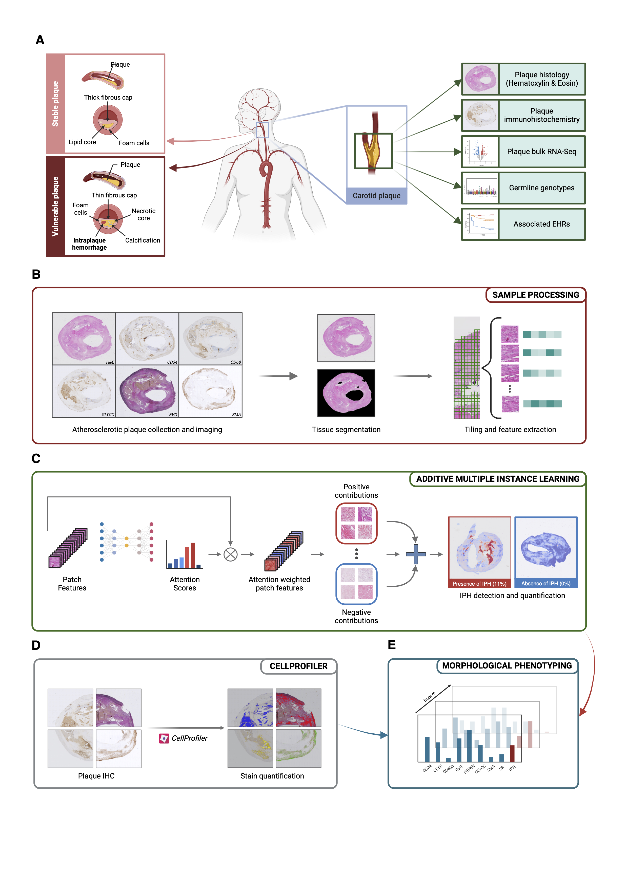
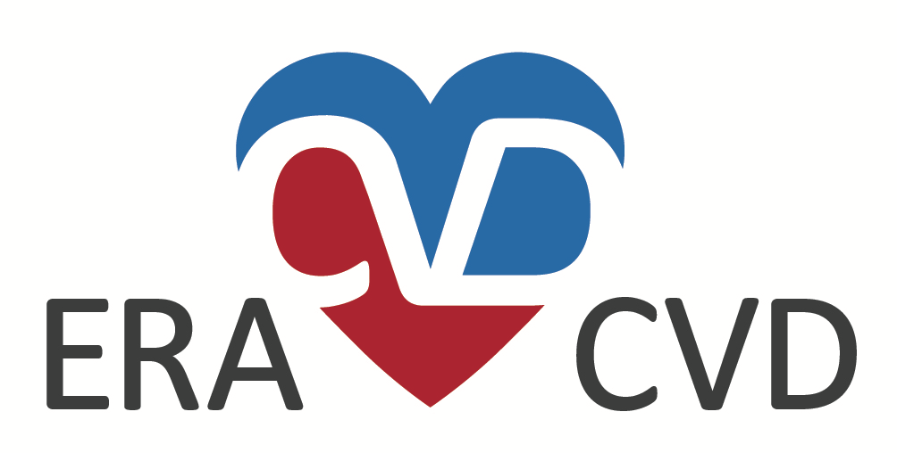

## Intraplaque haemorrhage quantification and molecular characterisation using attention based multiple instance learning

<!-- Please add a brief introduction to explain what the project is about    -->
Francesco Cisternino1*, Yipei Song2*, Tim S. Peters3*, Roderick Westerman3, Gert J. de Borst4, Ernest Diez Benavente3, Noortje A.M. van den Dungen3, Petra Homoed-van der Kraak5, Dominique P.V. de Kleijn4, Joost Mekke4, Michal Mokry3, Gerard Pasterkamp3, Hester M. den Ruijter3,6, Evelyn Velema6, Clint L. Miller2*, Craig A. Glastonbury1,7*, S.W. van der Laan2,3*.

* these authors contributed equally

_**Affiliations**_ 
_1 Human Technopole, Viale Rita Levi-Montalcini 1, 20157, Milan, Italy;_ 
_2 Department of Genome Sciences, University of Virginia, Charlottesville, VA, USA;_ 
_3 Central Diagnostic Laboratory, Division Laboratories, Pharmacy, and Biomedical genetics,  University Medical Center Utrecht, Utrecht University, Utrecht, the Netherlands;_ 
_4 Vascular surgery, University Medical Center Utrecht, Utrecht University, Utrecht, the Netherlands;_ 
_5 Pathology, University Medical Center Utrecht, Utrecht University, Utrecht, the Netherlands;_ 
_6 Experimental Cardiology, Department Cardiology, Division Heart & Lungs, University Medical Center Utrecht, Utrecht University, Utrecht, the Netherlands;_ 
_7 Nuffield Department of Medicine, University of Oxford, Oxford, UK._

### Background

Intraplaque haemorrhage (IPH) represents a critical feature of plaque vulnerability as it is robustly associated with adverse cardiovascular events, including stroke and myocardial infarction. How IPH drives plaque instability is unknown. However, its identification and quantification in atherosclerotic plaques is currently performed manually, with high inter-observer variability, limiting its accurate assessment in large cohorts. Leveraging the Athero-Express biobank, an ongoing study comprising a comprehensive dataset of histological, transcriptional, and clinical information from 2,595 carotid endarterectomy patients, we developed an attention-based additive multiple instance learning (MIL) framework to automate the detection and quantification of IPH across whole-slide images of nine distinct histological stains (Figure below). We demonstrate that routinely available Haematoxylin and Eosin (H&E) staining outperformed all other plaque relevant Immunohistochemistry (IHC) stains tested (AUROC = 0.86), underscoring its utility in quantifying IPH. When combining stains through ensemble models, we see that H&E + CD68 (a macrophage marker) as well as H&E + Verhoeff-Van Gieson elastic fibers staining (EVG) leads to a substantial improvement (AUROC = 0.92). Using our model, we could derive IPH area from the MIL-derived patch-level attention scores, enabling not only classification but precise localisation and quantification of IPH area in each plaque, facilitating downstream analyses of its association and cellular composition with clinical outcomes. By doing so, we demonstrate that IPH presence and area are the most significant predictors of both preoperative symptom presentation and major adverse cardiovascular events (MACE), outperforming manual scoring methods. Automating IPH detection also allowed us to characterise IPH on a molecular level at scale. Pairing IPH measurements with single-cell transcriptomic analyses revealed key molecular pathways involved in IPH, including TNF-α signalling, extracellular matrix remodelling and the presence of foam cells. This study represents the largest effort in the cardiovascular field to integrate digital pathology, machine learning, and molecular data to predict and characterize IPH which leads to better understanding how it drives  symptoms and MACE. Our model provides a scalable, interpretable, and reproducible method for plaque phenotyping, enabling the derivation of plaque phenotypes for predictive modelling of MACE outcomes.

<!-- add in figure of study -->
Figure01.png
**Figure 1: Schematic research overview.**
**(A)** Carotid plaque vulnerability shows up with specific biomarkers, like development of intraplaque haemorrhage (IPH) and calcification (Left). In this study carotid plaques were collected during endarterectomy. Samples were stained with Hematoxylin & Eosin and 8 additional histological and immuno-histochemical (IHC) markers, plaque bulk RNA-Seq were collected, together with germline genotypes; electronic health records are available for the whole cohort (Right). **(B)** After scanning the stained tissue samples, whole-slide images (WSI) were pre-processed by segmenting tissue regions from background, patching and performing feature extraction. **(C)** Attention-based additive multiple instance learning was employed to predict, quantify and localize IPH in the tissue; coupling this image-derived biomarker with stain quantification from CellProfiler **(D)** resulted in a complete morphological phenotyping **(E)** of carotid plaques.

#### Study design

We will use data from the [*Athero-Express Biobank Study (AE)*](https://doi.org/10.1007/s10564-004-2304-6) comprising ±2,500 carotid endarterectomy patients of whom extensive clinical data (demographic, lifestyle, laboratory, medical history, and medication) as well as plaques are collected. At two Dutch tertiary referral centers patients are included that underwent endarterectomy; details of the study design were described [before](https://doi.org/10.1007/s10564-004-2304-6). Briefly, blood and plaque material were obtained during endarterectomy and stored at -80 ℃. Only carotid endarterectomy (CEA) patients were included in the present study. All patients provided informed consent and the study was approved by the medical ethics committee.
All plaques are histological assessed using 9 different standardized protocols for CD34, CD66b, CD68, SMA, elastin, hematoxylin, picro-sirius red, fibrin, glycophorin C and scanned at high-resolution into `.ndpi` or `.TIF` whole-slide images (WSI). For this project we will use all the available data from carotid plaques, i.e. 16,171 images and clinical data, to build a multiple instance learning model to predict intraplaque haemorrhage.

<!-- Please add a brief introduction to explain what the project is about    -->

### Where do I start?

You can load this project in RStudio by opening the file called 'PHENOMICL_downstream.Rproj'.

### Project structure

<!--  You can add rows to this table, using "|" to separate columns.         -->
File                | Description                | Usage         
------------------- | -------------------------- | --------------
README.md           | Description of project     | Human editable
PHENOMICL_downstream.Rproj     | Project file               | Loads project 
LICENSE             | User permissions           | Read only     
.worcs              | WORCS metadata YAML        | Read only     
renv.lock           | Reproducible R environment | Read only     
images              | Images used in readme, etc | Human editable
scripts             | Script to process data     | Human editable
targets             | Script to process data     | Human editable
references.bib             | References     | Human editable
packages.bib             | References for packages    | Human editable
BASELINE             | Baseline characteristics     | Human editable
OUTPUT             | Other outputs    | Human editable
results             | Results from downstream analyses     | Human editable
1. AEDB.CEA.baseline.nb.html             | R notebook in HTML     | Read only
1. AEDB.CEA.baseline.Rmd             | R notebook to parse the clinical data     | Human editable
3_1_bulkRNAseq.preparation.nb.html             | R notebook in HTML     | Read only
3_1_bulkRNAseq.preparation.Rmd             | R notebook to parse the RNAseq data     | Human editable

<!--  You can consider adding the following to this file:                    -->
<!--  * A citation reference for your project                                -->
<!--  * Contact information for questions/comments                           -->
<!--  * How people can offer to contribute to the project                    -->
<!--  * A contributor code of conduct, https://www.contributor-covenant.org/ -->

### Reproducibility

This project uses the Workflow for Open Reproducible Code in Science (WORCS) to
ensure transparency and reproducibility. The workflow is designed to meet the
principles of Open Science throughout a research project. 

To learn how WORCS helps researchers meet the TOP-guidelines and FAIR principles,
read the preprint at https://osf.io/zcvbs/

#### WORCS: Advice for authors

* To get started with `worcs`, see the [setup vignette](https://cjvanlissa.github.io/worcs/articles/setup.html)
* For detailed information about the steps of the WORCS workflow, see the [workflow vignette](https://cjvanlissa.github.io/worcs/articles/workflow.html)

#### WORCS: Advice for readers

Please refer to the vignette on [reproducing a WORCS project]() for step by step advice.
<!-- If your project deviates from the steps outlined in the vignette on     -->
<!-- reproducing a WORCS project, please provide your own advice for         -->
<!-- readers here.                                                           -->

### Questions and issues

<!-- Do you have burning questions or do you want to discuss usage with other users? Please use the Discussions tab.-->

Do you have burning questions or do you want to discuss usage with other users? Do you want to report an issue? Or do you have an idea for improvement or adding new features to our method and tool? Please use the [Issues tab](https://github.com/CirculatoryHealth/EntropyMasker/issues).

### Citations

Using our **`PHENOMICL`** method? Please cite our work:

    Intraplaque haemorrhage quantification and molecular characterisation using attention based multiple instance learning
    Francesco Cisternino, Yipei Song, Tim S. Peters, Roderick Westerman, Gert J. de Borst, Ernest Diez Benavente, Noortje A.M. van den Dungen, Petra Homoed-van der Kraak, Dominique P.V. de Kleijn, Joost Mekke, Michal Mokry, Gerard Pasterkamp, Hester M. den Ruijter, Evelyn Velema, Clint L. Miller, Craig A. Glastonbury, S.W. van der Laan.
    medRxiv ; doi: 

### Data availability

The whole-slide images used in this project are available through a [DataverseNL repository](https://doi.org/10.34894/QI135J "ExpressScan: Histological whole-slide image data from the Athero-Express (AE) and Aneurysm-Express (AAA) Biobank Studies"). There are restrictions on use by commercial parties, and on sharing openly based on (inter)national laws, regulations and the written informed consent. Therefore these data (and additional clinical data) are only available upon discussion and signing a Data Sharing Agreement (see Terms of Access) and within a specially designed UMC Utrecht provided environment.

### Acknowledgements

We are thankful for the support of the Netherlands CardioVascular Research Initiative of the Netherlands Heart Foundation (CVON 2011/B019 and CVON 2017-20: Generating the best evidence-based pharmaceutical targets for atherosclerosis [GENIUS I&II]), the ERA-CVD program 'druggable-MI-targets' (grant number: 01KL1802), the Leducq Fondation 'PlaqOmics' and ‘AtheroGen’, and the Chan Zuckerberg Initiative ‘MetaPlaq’. The research for this contribution was made possible by the AI for Health working group of the [EWUU alliance](https://aiforhealth.ewuu.nl/). The collaborative project ‘Getting the Perfect Image’ was co-financed through use of PPP Allowance awarded by Health~Holland, Top Sector Life Sciences & Health, to stimulate public-private partnerships.

Funding for this research was provided by National Institutes of Health (NIH) grant nos. R00HL125912 and R01HL14823 (to Clint L. Miller), a Leducq Foundation Transatlantic Network of Excellence ('PlaqOmics') grant no. 18CVD02 (to Dr. Clint L. Miller and Dr. Sander W. van der Laan), the CZI funded 'MetaPlaq' (to Dr. Clint L. Miller and Dr. Sander W. van der Laan), EU HORIZON NextGen (grant number: 101136962, to Dr. Sander W. van der Laan), EU HORIZON MIRACLE (grant number: 101115381, to Dr. Sander W. van der Laan), and Health~Holland PPP Allowance ‘Getting the Perfect Image’ (to Dr. Sander W. van der Laan).

Dr Craig A. Glastonbury has stock options in BenevolentAI and is a paid consultant for BenevolentAI, unrelated to this work. Dr. Sander W. van der Laan was funded by Roche Diagnostics, as part of 'Getting the Perfect Image', however Roche was not involved in the conception, design, execution or in any other way, shape or form of this project. 

Plaque samples are derived from arterial endarterectomies as part of the [Athero-Express Biobank Study](https://doi.org/10.1007/s10564-004-2304-6) which is an ongoing study in the UMC Utrecht. We would like to thank all the (former) employees involved in the Athero-Express Biobank Study of the Departments of Surgery of the St. Antonius Hospital Nieuwegein and University Medical Center Utrecht for their continuing work. In particular we would like to thank (in no particular order) Marijke Linschoten, Arjan Samani, Petra H. Homoed-van der Kraak, Tim Bezemer, Tim van de Kerkhof, Joyce Vrijenhoek, Evelyn Velema, Ben van Middelaar, Sander Reukema, Robin Reijers, Joëlle van Bennekom, and Bas Nelissen. Lastly, we would like to thank all participants of the Athero-Express Biobank Study; without you these studies would not be possible.

The framework was based on the [`WORCS` package](https://osf.io/zcvbs/).

        

#### Changes log

    Version:      v1.2.0
    Last update:  2025-03-04
    Written by:   Francesco Cisternino; Craig Glastonbury; Sander W. van der Laan; Clint L. Miller; Yipei Song.
    Description:  CONVOCALS repository: classification of atherosclerotic histological whole-slide images
    Minimum requirements: R version 3.4.3 (2017-06-30) -- 'Single Candle', Mac OS X El Capitan

    **MoSCoW To-Do List**
    The things we Must, Should, Could, and Would have given the time we have.
    _M_

    _S_

    _C_

    _W_
    
    Changes log
    * v1.2.0 Major updates and re-organization prior to submission.
    * v1.1.0 Major updates and re-organization. Added baseline table creation. Added WORCS metadata. Added details on funding. Added bulkRNAseq analyses. Added scRNAseq analyses.
    * v1.0.1 Updates and re-organization.
    * v1.0.0 Initial version. 
    
    
--------------

#### Creative Commons BY-NC-ND 4.0
##### Copyright (c) 2025 [Francesco Cisternino]() \| [Craig Glastonbury](https://github.com/GlastonburyC) \| [Sander W. van der Laan](https://github.com/swvanderlaan) \| [Clint L. Miller](https://github.com/clintmil) \| [Yipei Song](https://github.com/PetraSong) 

This is a human-readable summary of (and not a substitute for) the [license](LICENSE). 
 
You are free to share, copy and redistribute the material in any medium or format. The licencor cannot revoke these freedoms as long as you follow the license terms. 
 
Under the following terms:  
<em>- Attribution</em> — You must give appropriate credit, provide a link to the license, and indicate if changes were made. You may do so in any reasonable manner, but not in any way that suggests the licensor endorses you or your use. 
<em>- NonCommercial</em> — You may not use the material for commercial purposes. 
<em>- NoDerivatives</em> — If you remix, transform, or build upon the material, you may not distribute the modified material. 
<em>- No additional</em> restrictions — You may not apply legal terms or technological measures that legally restrict others from doing anything the license permits. 
 
Notices:  
You do not have to comply with the license for elements of the material in the public domain or where your use is permitted by an applicable exception or limitation.
No warranties are given. The license may not give you all of the permissions necessary for your intended use. For example, other rights such as publicity, privacy, or moral rights may limit how you use the material.

